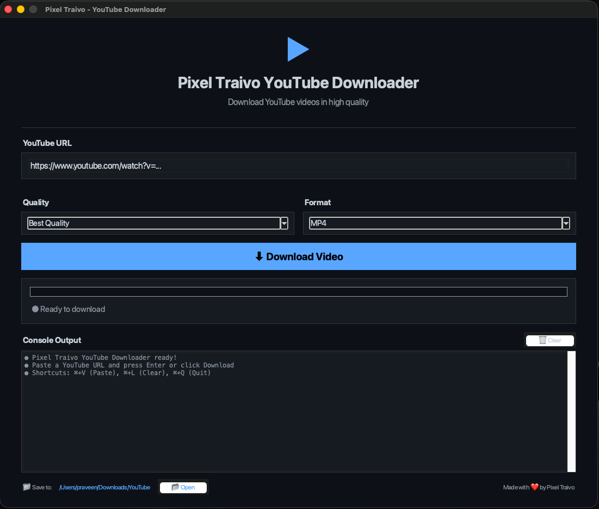
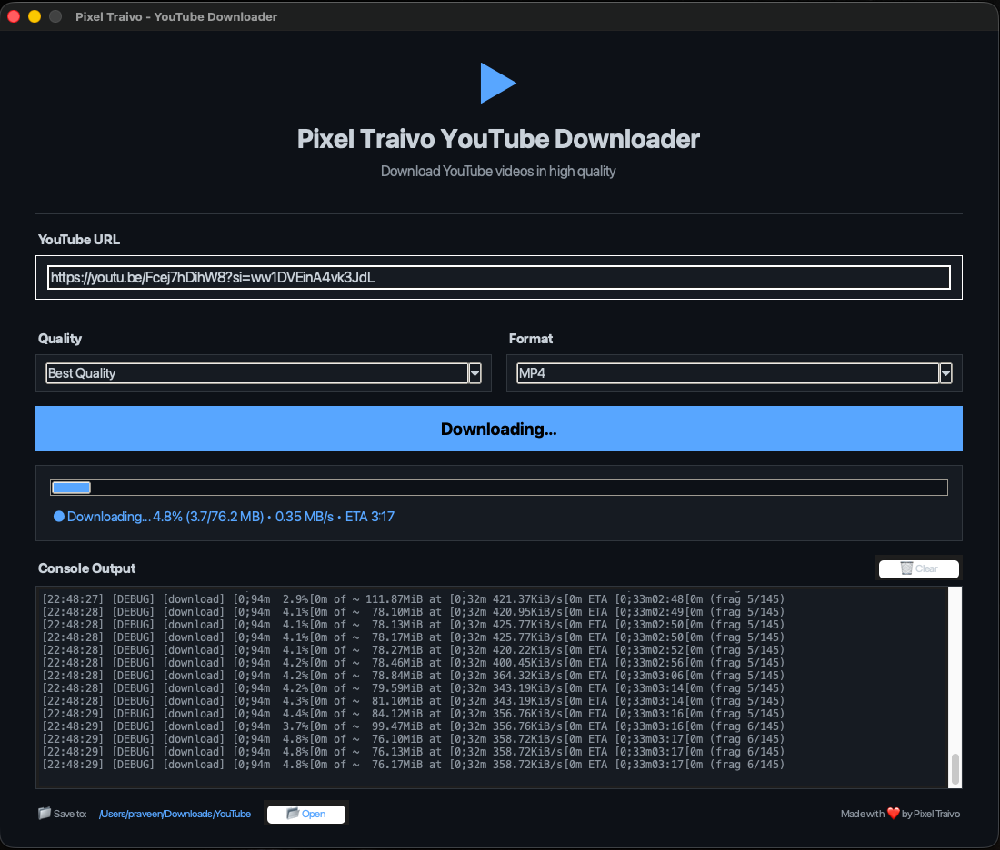

<div align="center">

# 🎬 SnapVid - YouTube Downloader

**Professional YouTube video downloader for macOS with beautiful UI**

[](https://www.apple.com/macos)
[](https://www.python.org)
[](LICENSE)
[](https://github.com/praveensinghlko/SnapVid-Downloader/releases/latest)



[📥 Download Latest Release](https://github.com/praveensinghlko/SnapVid-Downloader/releases/latest) • [🐛 Report Bug](https://github.com/praveensinghlko/SnapVid-Downloader/issues)

</div>

---

## ✨ Features

- 🎯 **High-Quality Downloads** - Up to 1080p resolution
- 🎵 **Audio Extraction** - Download as MP3
- 📊 **Real-Time Progress** - Live download speed and ETA
- 🎨 **Beautiful Interface** - Clean, modern dark theme
- 💾 **Custom Location** - Choose where to save files
- ⚡ **Fast & Efficient** - Powered by yt-dlp
- 🔄 **Universal Binary** - Works on M1/M2 and Intel Macs
- 📂 **No Dependencies** - Everything bundled in the app

---

## 📥 Installation

### For Users

1. **Download** the latest `.dmg` file from [Releases](https://github.com/praveensinghlko/SnapVid-Downloader/releases/latest)
2. **Open** the downloaded DMG file
3. **Drag** the app to your Applications folder
4. **Launch** from Applications
   - First time: Right-click → **Open** → Click **Open**
   - After that: Just double-click!



### System Requirements

- macOS 10.13 or later
- 200 MB free disk space
- Internet connection

---

## 🚀 Usage

1. Launch the application
2. Paste a YouTube URL
3. Select quality and format
4. Click "Download Video"
5. Done!

### ⌨️ Keyboard Shortcuts

| Shortcut | Action |
|----------|--------|
| `⌘ + V` | Paste URL |
| `↵ Enter` | Start download |
| `⌘ + L` | Clear console |
| `⌘ + Q` | Quit app |

---

## 🛠️ Build from Source

```bash
# Clone repository
git clone https://github.com/praveensinghlko/SnapVid-Downloader.git
cd SnapVid-Downloader

# Build
chmod +x build.sh
./build.sh

</div>
